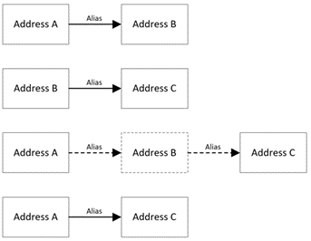
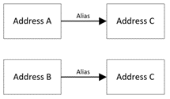

# get-live-key
A recursive SQL CTE to find the live address key among alias relationships.

Some of the explanation is contained in the code comments. The following explanation is additional to that and has useful visualisations of how the query works.

In the address location register table, when an address is considered to reference the same place as another address, one of these addresses is marked as an alias of the other. For example, if address A is marked as an alias of address B, then address B is considered the “current” address, so should be used instead of address A. In some cases, there are multiple addresses considered to reference the same place, so all but one are marked as an alias. In these more complex cases, it can be difficult to find the address that is not marked as an alias among these. 
This query is intended to reduce the complexity of following a chain of addresses that have been aliased to the final address key in the chain. For example, if address A is marked as an alias of address B and address B is marked as an alias of address C, the “current” address is address C. In this case, address C should be used instead of address A or address B. Here’s a visualisation:

The results of this query tells you which address you’ll end up at if you follow the alias relationships for each address in a chain of alias addresses. It can also help in the case where multiple addresses are aliased to the same address.
  

